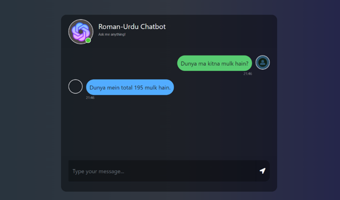

# AI Chatbot for Roman Urdu

 
This project focuses on building a chatbot that understands and generates responses in Roman Urdu using Generative AI techniques, specifically within a Retrieval-Augmented Generation (RAG) framework.
 
## Introduction
 
Roman Urdu, a variant of Urdu written using the Roman alphabet, is widely used in digital communication. Traditional chatbots struggle with Roman Urdu due to spelling variability and code-switching. This project leverages a RAG framework with GPT to enhance chatbot accuracy and usability for Roman Urdu speakers.
 
 
## Technologies Used 
Python 
LangChain for workflow management 
OpenAI Embedding Model for text embeddings 
GPT (Generative Pre-trained Transformer) for language generation 
Chroma for vector database storage 
Flask for API development 
Dataset 

 
## Data collected from: 
Social media platforms 
Hugging Face datasets 
User-generated content 
Includes preprocessing steps like normalization, tokenization, and embedding generation. 
 
## Architecture 
The chatbot uses the Retrieval-Augmented Generation (RAG) model: 
 
Retrieval: Retrieves relevant Roman Urdu data using Chroma. 
Generation: GPT generates responses based on retrieved context. 
LangChain Integration: Manages interaction between retrieval and generation components.
 
 
 

